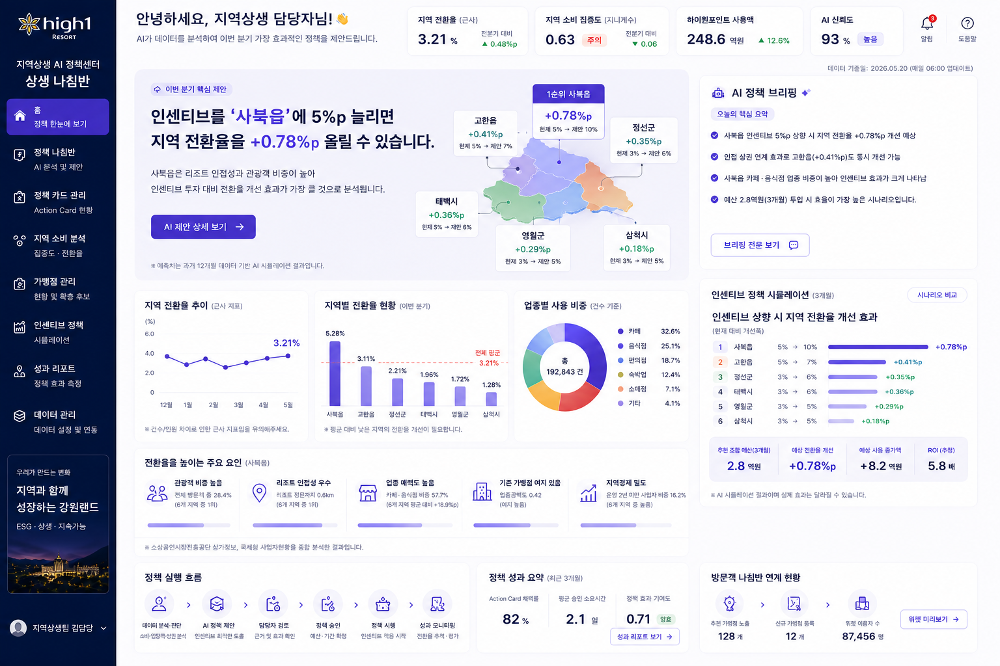
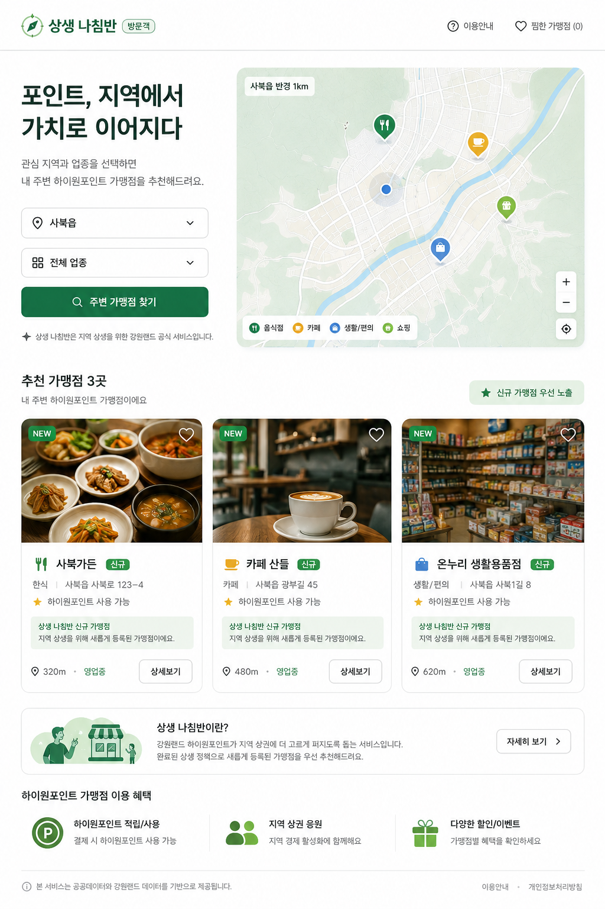

# 상생 나침반 (Sangseng Navigator)

> **강원랜드 담당자의 분기별 지역상생 의사결정을 지원하는 AI 정책 나침반** — 하이원포인트 소비 쏠림
> 진단부터 가맹점 확충·페이백 정책 제안, 담당자 승인, 방문객 추천 위젯 반영까지.
>
> 팀 **V.I.B.E** | 공공데이터 활용 바이브코딩 경진대회 출품작

**🔗 배포 URL: `https://<project>.vercel.app`** *(Phase 1 배포 후 확정 — 로그인 없이 접속 가능)*

공공데이터 시각화 대시보드가 아니라, "이번 분기 상생 노력을 어디에 집중해야 하는가"에 데이터와 AI로
답하는 **의사결정 지원 플랫폼**입니다. 진단(소비 집중도·지역 전환율) → 2단계 스코어링 → AI 조정 제안 →
담당자 승인(Action Card) → 실행 상태 트래킹 → 방문객 위젯 반영의 전체 루프를 구현합니다.

## 왜 이 서비스가 필요한가

지역상생 담당자는 소비가 어느 지역·업종에 쏠렸는지는 여러 자료에서 볼 수 있지만, 그 다음 행동인
**후보 선정 → 근거 비교 → 승인 → 실행 추적 → 방문객 노출 → 성과 회고**는 문서와 담당자 경험에
흩어져 있습니다. 상생 나침반은 이 단절을 하나의 Work Item으로 연결해 다음 세 가지 질문에 답합니다.

1. 지금 어디를 먼저 검토해야 하는가 — 정량 Score와 원자료 기준월을 함께 제시합니다.
2. 왜 그 후보인가 — AI 제안과 서버가 재검증한 숫자·순위·상태를 분리해 보여줍니다.
3. 결정 후 무엇이 달라졌는가 — 승인·추진 상태와 방문객 추천 반영을 같은 카드로 추적합니다.

이 서비스의 고객 가치는 “AI가 정책을 대신 결정”하는 데 있지 않습니다. 제한된 담당자 시간을 근거가
있는 후보와 후속 조치에 집중시키고, 보류·반려까지 기록 가능한 **감사 가능한 의사결정 흐름**을 만드는
데 있습니다.

## 대표 화면

| 담당자 대시보드 | 방문객 위젯 |
|---|---|
|  |  |

*(현재는 디자인 목업 — Phase 6에서 실 구현 스크린샷으로 교체)*

## 활용 데이터

| 데이터셋 | 제공 | 형태 | 역할 |
|---|---|---|---|
| (주)강원랜드_하이원포인트 사용현황 | 강원랜드 · 공공데이터포털 | 파일데이터(CSV) | 소비 집중도·전환율 분자·1단계 읍 스코어링 |
| (주)강원랜드_하이원포인트 가맹점 상세정보 | 강원랜드 · 공공데이터포털 | 오픈 API | 가맹점 지오코딩 → 지도·2단계 스코어링·위젯 추천 |
| (주)강원랜드_일자별 카지노 입장객 현황 | 강원랜드 · 공공데이터포털 | 오픈 API | "지역 전환율"의 분모 (리조트 체류 규모) |
| 소상공인시장진흥공단_상가(상권)정보 | 소진공 · 공공데이터포털 | 오픈 API | 반경 500m 업종공백도·포화도 |
| 국세청_사업자현황 (100대 생활업종·존속연수별) | 국세청 | 파일데이터(CSV) | 지역경제 위험 신호 (진단 참고용 파생지표) |

원본 CSV는 `data/raw/`에, 파이프라인 산출 JSON은 `data/processed/`에 커밋합니다(후자는 파이프라인
실행 후 생성). 산출물은 **배포 환경에서 외부 API 호출 없이** 이 정적 데이터로 동작합니다
(경진대회 권장 "정적 데이터 방식").

## 주요 기능

1. **소비 집중도 진단** — 지역 소비 집중도·업종별 소비 분산도·월별 추이 (내부 산식은 발표 자료 참조)
2. **지역 전환율** — 리조트 체류 규모 대비 지역 소비 전환 비율 헤드라인 (단위가 달라 `근사 지표` 상시 표기)
3. **AI 정책 나침반** — 읍 단위 → 반경 500m 2단계 스코어링 + AI가 추진현황·계절성·형평성을 종합해
   가맹점 확충 우선순위(Action Card) 제안. **AI는 제안만, 확정은 담당자 승인** (원 Score 순위 상시 병기)
4. **정책 시뮬레이션** — "이 후보가 가맹 전환하면?" 반사실 재계산 + AI 설명 (가정 기반 전망 문구 고정)
5. **인센티브 정책 카드** — 페이백률 3/5/7% 시나리오 비교 (수요 측 해법)
6. **방문객 나침반 위젯** — 지역·업종 선택만으로 가맹점 추천, 확충 완료 신규 가맹점 우선 노출

## 현재 운영 경계

현재 구현은 경진대회용 의사결정 지원 MVP입니다. 카드 승인은 가맹 확정이 아니라 **후보 접촉과 적격성
검토를 시작하는 내부 정책 결정**입니다. 영업 상태·가맹 자격·사업자 참여 의향·관광객 이용 적합성·정산
연동 가능성은 별도 확인이 필요합니다. 데이터 기준월이 4개월 이상 경과하면 화면에 갱신 경고를 표시하며,
시뮬레이션 효과가 미미한 경우 보류도 정상적인 선택지로 안내합니다.

실운영 전환에 필요한 단계와 우선순위는 [제품·운영 전환 로드맵](docs/plan/16-product-and-production-roadmap.md)에
정리했습니다.

## 30초 둘러보기 (심사용 추천 경로)

홈(Action Card 허브)에서 헤드라인·AI 제안 카드 확인 → 카드 클릭해 2단계 근거·지도 확인 →
"이 후보가 가맹 전환하면?" 시뮬레이션 → 승인 → 트래킹에서 완료 처리 → 방문객 위젯에서 해당 지역
선택 시 신규 가맹점 우선 노출 확인 → 인센티브 카드의 페이백 시나리오 비교.

## 실행 방법

**심사·체험**: 위 배포 URL 접속 (로그인 불필요, 모바일 지원).

**로컬 실행**:

```bash
git clone https://github.com/yutakdv/sangseng-navigator && cd sangseng-navigator
cp .env.example .env                       # 키 입력 절차: docs/plan/04-env-and-data.md

# 데이터 파이프라인 (data/processed/ 재생성 — 이미 커밋돼 있어 생략 가능)
cd pipeline && python run_all.py

# 전체 기동 (FE + BE + DynamoDB Local + 데모 카드 시드)
docker compose up -d                       # FE http://localhost:3100 · BE http://localhost:8000
# 포트를 바꾸려면 FRONTEND_PORT 환경변수를 별도로 지정한다

# 개별 실행이 필요할 때
cd backend && uvicorn app.main:app --reload --port 8000
cd frontend && npm install && npm run dev  # NEXT_PUBLIC_API_BASE 미설정 시 mock 모드
```

## 기술 스택

Next.js 16 (App Router, TS, Tailwind 3, Recharts, MapLibre GL + OpenFreeMap) /
FastAPI on AWS Lambda + API Gateway + DynamoDB (SAM, 월 비용 사실상 $0) /
Python 데이터 파이프라인 (정적 JSON 사전 계산) / LLM (OpenAI ↔ Anthropic 어댑터) /
배포: Vercel(FE) + AWS SAM(BE)

## 팀 구성

| 역할 | 담당 |
|---|---|
| 기획·발표 | 팀 V.I.B.E (기획 4인 · 개발 2인) |
| BE · AI · 데이터 파이프라인 · AWS 배포 (+FE 지원) | 유탁 (Claude 바이브 코딩) |
| FE (Next.js 화면 전체) | 팀원 1인 (mock 우선 개발 → 실 API 전환) |

## 개발 문서

**모든 개발 계획은 [docs/plan/README.md](docs/plan/README.md)에서 시작합니다.**

| 문서 | 내용 |
|---|---|
| [01-overview](docs/plan/01-overview.md) | 목표·범위·역할 분담·컷 리스트 |
| [02-architecture](docs/plan/02-architecture.md) | 시스템 구조 + AWS 최소비용 배포 아키텍처 |
| [03-repo-structure](docs/plan/03-repo-structure.md) | 모노레포 구조·협업 규칙·로컬 실행 |
| [04-env-and-data](docs/plan/04-env-and-data.md) | ★ ENV·API키·파일데이터 준비 (개발 전 필수) |
| [05-api-contract](docs/plan/05-api-contract.md) | FE↔BE API 계약 (mock의 기준) |
| [06-pipeline-tasks](docs/plan/06-pipeline-tasks.md) | 데이터 파이프라인 태스크 (계산식 포함) |
| [07-backend-ai-tasks](docs/plan/07-backend-ai-tasks.md) | FastAPI + LLM 태스크 |
| [08-frontend-tasks](docs/plan/08-frontend-tasks.md) | 프론트엔드 화면별 태스크 |
| [09-deployment](docs/plan/09-deployment.md) | 배포 절차 + 비용 + 심사 기간 운영 |
| [10-timeline](docs/plan/10-timeline.md) | Phase 0~6 작업 순서 체크리스트 |
| [11-demo-and-qa](docs/plan/11-demo-and-qa.md) | 데모 스크립트·발표 구조·예상 질문 대응 |
| [12-submission-compliance](docs/plan/12-submission-compliance.md) | 경진대회 제출 요건 대응 |
| [13-design-guide](docs/plan/13-design-guide.md) | 목업 기반 디자인 가이드 |
| [16-product-and-production-roadmap](docs/plan/16-product-and-production-roadmap.md) | 서비스 존재 이유·사용자 검증·실운영 전환 로드맵 |

## 유의사항·출처 표기

- "지역 전환율"은 분자(거래 건수)·분모(입장 인원수)의 단위가 달라 **근사 지표**이며, 화면·발표에
  항상 배지로 고지합니다. 모든 시뮬레이션 수치는 **가정 기반 전망**으로 실제와 다를 수 있습니다.
- AI 출력은 제안일 뿐이며, 담당자 승인을 거쳐야 정책 카드가 확정됩니다. 카드의 숫자·순위·상태 문구는
  LLM 원문을 그대로 노출하지 않고 정본 데이터로 다시 생성합니다.
- 데이터: 공공데이터포털(강원랜드·소상공인시장진흥공단)·국세청 | 지도: © OpenStreetMap contributors, OpenFreeMap
