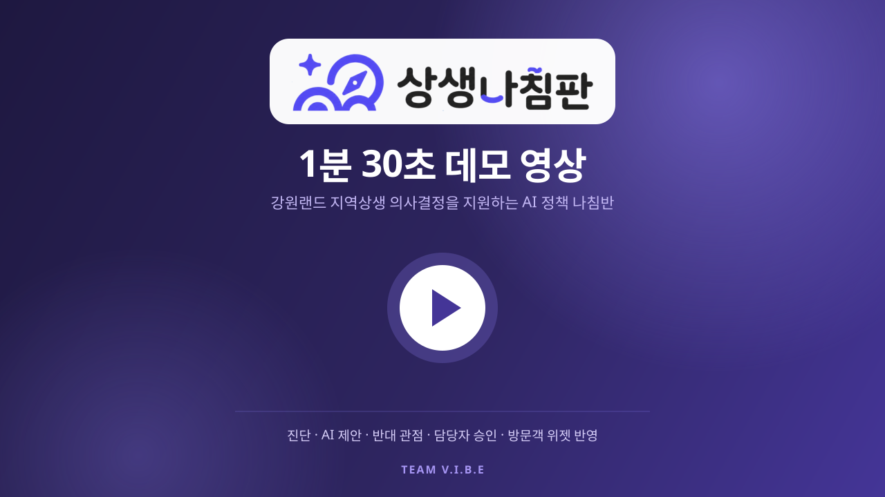
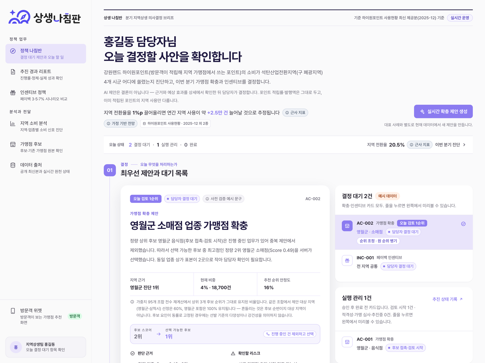
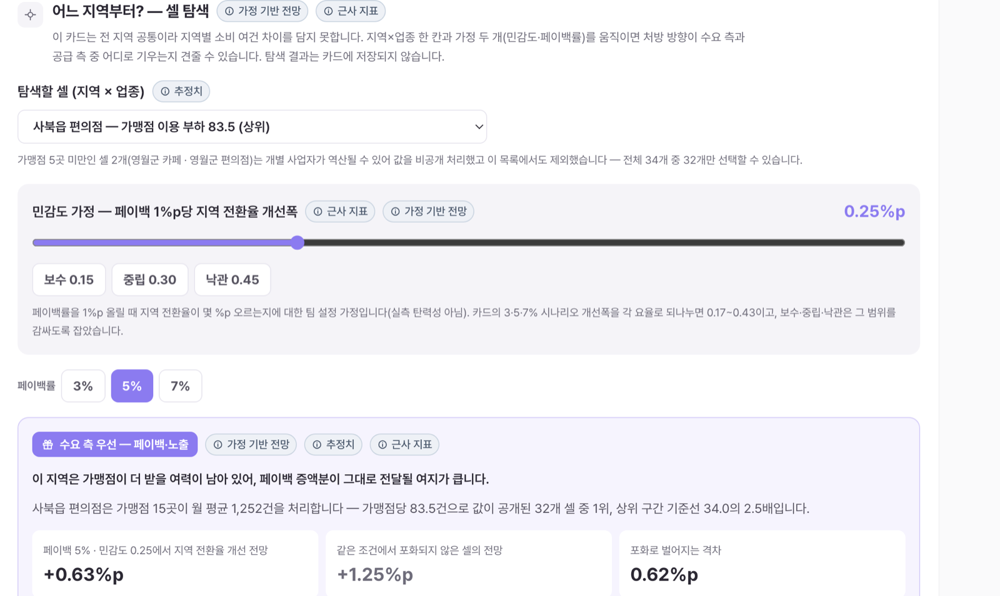
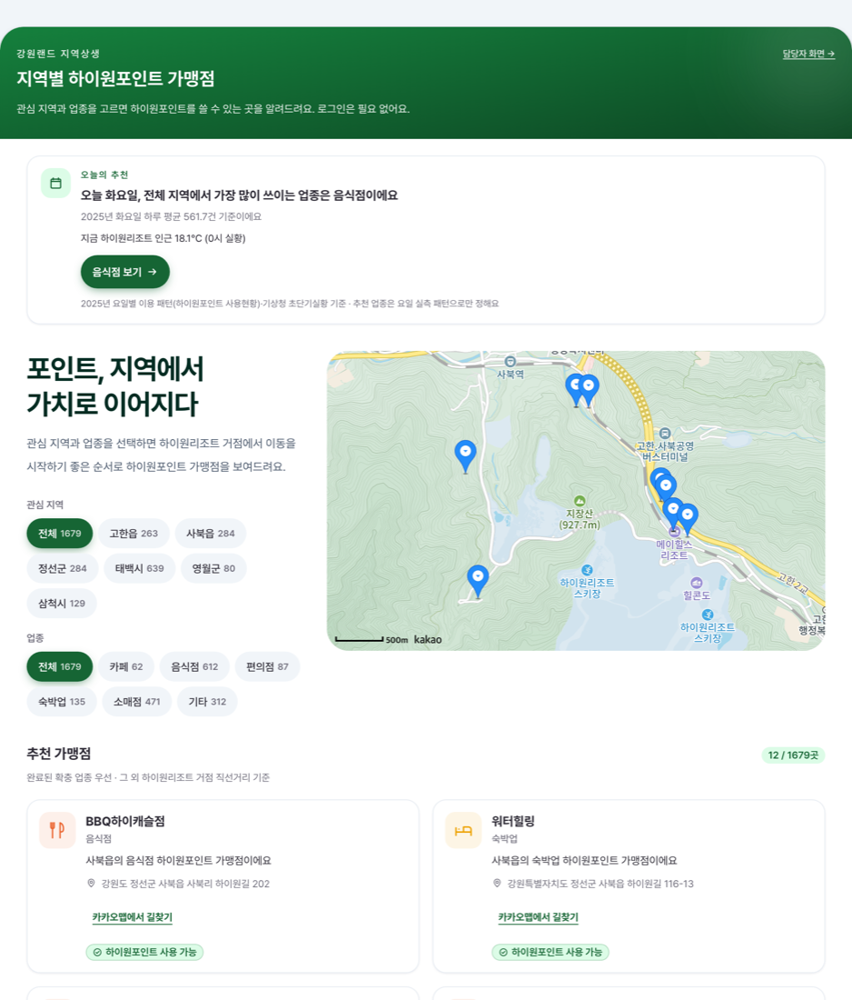
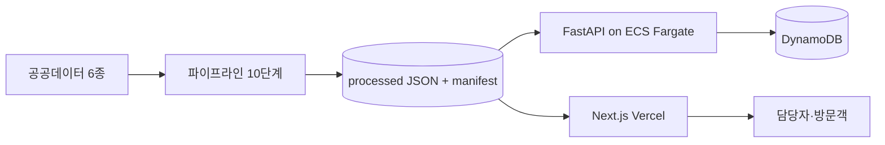
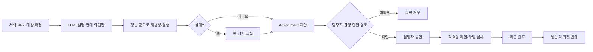

<div align="center">


# 상생 나침반 · Sangseng Navigator

**강원랜드 담당자의 분기별 지역상생 의사결정을 지원하는 AI 정책 나침반**

하이원포인트 소비 쏠림 진단 → 2단계 스코어링 → AI 제안·반대 관점 → **담당자 승인** → 추진 트래킹 → **확충 완료** → 방문객 위젯 반영

[](https://sangseng-navigator.vercel.app)
<!-- 영상 업로드 후 아래 배지 주석을 해제한다 (아래 "영상 넣는 자리"와 함께)
[](#demo)
-->
[](#-활용-데이터)
[](#-기술-스택)
[](LICENSE)

**팀 V.I.B.E** · 공공데이터 활용 바이브코딩 경진대회 출품작 · 로그인 없이 접속 가능

</div>

> **🔗 배포 URL: <https://sangseng-navigator.vercel.app>** *(로그인 없이 접속 · 모바일 지원)*

---

<a id="demo"></a>

## 🎬 데모 영상 · 1분 30초

<div align="center">

<!--
  ┌── 영상 넣는 자리 · 아래 A / B / C 중 하나만 남기고 나머지는 지운다 ─────────────────────
  │
  │ A. README에서 바로 재생 (가장 권장 — 심사위원이 클릭 없이 본다)
  │    GitHub 이슈 작성창(New issue)에 mp4 파일을 끌어다 놓으면 업로드되면서
  │    https://github.com/user-attachments/assets/xxxxxxxx 주소가 만들어진다.
  │    이슈를 등록할 필요는 없다 — 주소만 복사하고 창을 닫으면 된다.
  │    그 주소를 아래 <a>…</a> 블록 대신 "한 줄로만" 붙여 넣으면 플레이어가 뜬다.
  │
  │ B. YouTube 링크 썸네일 (지금 설정된 방식)
  │    아래 <a href="..."> 의 주소를 유튜브 주소로 바꾼다.
  │    커버 이미지는 그대로 둬도 되고, 실제 영상 한 장면(1280×720 PNG)으로 바꾸려면
  │    docs/images/demo-cover.png 로 저장한 뒤 아래 도 같이 바꾼다.
  │
  │ C. 레포에 직접 커밋 (파일 100MB 미만일 때만)
  │    docs/media/demo.mp4 로 커밋한 뒤, 아래 <video> 주석을 해제하고 <a> 블록을 지운다.
  └──────────────────────────────────────────────────────────────────────────────
-->

<!-- B안 사용 시: 아래 <a> 주석을 해제하고 VIDEO_ID를 실제 유튜브 ID로 바꾼다.
<a href="https://youtu.be/VIDEO_ID">
  
</a>
-->


<!-- C안:
<video src="https://github.com/yutakdv/sangseng-navigator/raw/main/docs/media/demo.mp4" controls width="780"></video>
-->

</div>

**팀 V.I.B.E가 만든 90초 소개 영상.** 문제 정의부터 실제 화면 동작까지 한 번에 보여 줍니다.

| 장면 | 영상에서 보게 되는 것 |
|---|---|
| ① **문제** | 하이원포인트 소비가 리조트 인근 두 읍에 쏠려 있고, 그 다음 행동은 문서와 담당자 경험에 흩어져 있다 |
| ② **진단** | 지역 소비 집중도·업종별 소비 분산도·지역 전환율(근사 지표)을 한 화면에서 확인 |
| ③ **제안과 반대 관점** | 서버가 대상을 확정하고 AI가 근거를 설명 — 그리고 **AI가 자기 제안을 반박**하는 3항 |
| ④ **담당자 승인** | 데이터 보호 범위·서버 검증 근거·AI 비교·반대 관점을 확인해야만 승인되는 Action Card |
| ⑤ **반전 장면** | 페이백 민감도를 올렸는데 처방이 **수요 측 → 공급 측으로 뒤집히는** 10초 |
| ⑥ **방문객 반영** | 승인 후 적격성·가맹 심사를 거쳐 **완료된 확충 업종**이 방문객 추천에 나타난다 |

---

## ⏱ 3분 심사 경로

> 배포 URL 뒤에 아래 경로를 붙이면 바로 열립니다. 로그인·설치 없이 모바일에서도 동작합니다.

| # | 화면 | 여기서 확인할 것 |
|---|---|---|
| 1 | **허브** `/` | 임팩트 헤드라인 — 지역 전환율(근사 지표) **1%p 개선 ≈ 연간 +24,787건** 추정, 이번 분기 결정 대기 카드 |
| 2 | **제안 검토** `/proposals/<카드 id>` | 왜 이 후보인지, 출처 칩과 함께 — **원 Score 순위 병기**(AI가 순위를 바꿔도 원본을 감추지 않는다) |
| 3 | **반대 관점** (제안 검토 안) | AI가 스스로 제기하는 반박 3항 — 승인 전 확인 장치 |
| 4 | **승인** (제안 검토 안) | 승인 / 보류 / 반려. AI 출력은 제안일 뿐, 카드는 담당자 클릭으로 확정 |
| 5 | **근거 상세** `/cards/<카드 id>` | 1단계 읍·시 진단 → 2단계 반경 500m 근거, 지도, "가맹 전환하면?" 반사실 시뮬레이션 |
| 6 | **반전 장면** `/incentive?preset=flip` | 민감도 슬라이더 한 칸(0.25 → 0.30)에 처방이 페이백 → 가맹점 확충으로 뒤집힘 |
| 7 | **방문객 위젯** `/widget` | 지역·업종만 고르면 가맹점 추천 — 확충 완료 업종이 우선 노출 |
| 8 | **전체 지역 현황** `/dashboard` | 6개 지역 전체 기준 진단 — 현황(실제 행정구역 경계 지도에서 지역 선택) / 추이·분포 / 제안 근거 세 뷰를 탭으로 전환(`?view=`) |
| 8-b | **지역 상세 분석** `/dashboard/region?region=영월군` | 지역 한 곳의 업종 구성·시간 패턴(월·요일·일) |
| 8-c | **데이터 활용 정보** `/data` | 공공데이터 6종의 원본 규모·사용 컬럼·산출물, 산출 스냅샷 SHA-256, 소표본 보호(k=5) 비공개 셀 내역 |

---

## 🖥 실제 화면

**담당자 콘솔 — 오늘 결정할 사안**



<table>
<tr>
<td width="52%" valign="top">

**반전 장면 — 처방이 뒤집히는 순간**



같은 카드, 같은 데이터인데 **지역×업종 한 칸**과 가정 두 개를 움직이면 처방 방향이 바뀝니다. 화면이 그 판정 근거(포화로 포기하는 격차 %p)를 숫자로 같이 냅니다.

</td>
<td width="48%" valign="top">

**방문객 위젯 — 승인 결과가 닿는 곳**



담당자의 결정이 적격성 확인·가맹 심사·완료까지 이어진 뒤 방문객 화면의 추천 순서에 반영됩니다. 로그인 없이, 요일 패턴과 현재 날씨까지 반영합니다.

</td>
</tr>
</table>

---

## 🧭 왜 이 서비스가 필요한가

강원랜드는 「석탄산업전환지역 개발 지원에 관한 특별법」에 따른 내국인 카지노 독점의 반대급부로 **폐광지역 경제 진흥이라는 법적 책무**를 집니다. 그런데 지역상생 담당자에게는 "소비가 어디에 쏠렸는가"를 보여 주는 자료는 있어도, 그 다음 행동인 **후보 선정 → 근거 비교 → 승인 → 추진 추적 → 방문객 노출 → 성과 회고**를 한 줄로 잇는 도구가 없습니다. 상생 나침반은 이 단절을 하나의 Work Item으로 묶어, **공급 측(가맹점 확충)과 수요 측(페이백 인센티브) 투트랙 처방**을 근거와 함께 제시하고 담당자의 결정으로 확정합니다.

> **「석탄산업전환지역 개발 지원에 관한 특별법」 제1조(목적)**
> "이 법은 석탄산업의 사양화로 인하여 낙후된 석탄산업전환지역의 경제를 진흥시켜 지역 간의 균형 있는 발전과 주민의 생활 향상을 도모함을 목적으로 한다."
> — 법률 제21254호(2025.12.30. 공포, 2026.3.31. 시행), 구 「폐광지역 개발 지원에 관한 특별법」 · [국가법령정보센터](https://www.law.go.kr/LSW/lsInfoP.do?urlMode=lsInfoP&lsId=000288)

> **강원랜드 지역상생 공시** — 2024년 하이원포인트 지역 사용금액 **355억 원 · 지역사용률 29.4%**(2024년도 지속가능경영보고서), 2025년 **415억 원(+16.8%, 역대 최대)**(2025년도 지속가능경영보고서, 2026-07 발간).

**참고 — 금액 기준 추세**: 하이원포인트 지역 사용금액은 2023년 328억 원(28.1%) → 2024년 355억 원(29.4%) → 2025년 415억 원(+16.8%)으로 늘고 있습니다. 강원랜드가 발생액 총액을 공개하지 않아 "1%p당 금액" 환산은 하지 않았습니다. 본 서비스의 **"지역 전환율"은 건수 기준 근사 지표**로, 위 금액 기준 공시와는 **종류가 다른 별개 지표**입니다(비교 불가 — 화면에도 항상 함께 고지).

### 이 서비스가 답하는 세 가지 질문

1. **지금 어디를 먼저 검토해야 하는가** — 정량 Score와 원자료 기준월을 함께 제시합니다.
2. **왜 그 후보인가** — AI 제안과, 서버가 정본 데이터로 재검증한 숫자·순위·상태를 분리해 보여 줍니다.
3. **결정 후 무엇이 달라졌는가** — 승인·추진 상태와 방문객 추천 반영을 같은 카드로 추적합니다.

고객 가치는 "AI가 정책을 대신 결정"하는 데 있지 않습니다. 제한된 담당자 시간을 근거 있는 후보에 집중시키고, **보류·반려까지 기록되는 감사 가능한 의사결정 흐름**을 만드는 데 있습니다.

이 설계는 강원랜드가 공개한 **상생추구·윤리·안전**의 경영 방향과 정보보호 사전통제 원칙에 맞닿아 있습니다. 그래서 데이터 발행 단계에서 소표본을 보호하고, AI가 대상·수치를 바꾸지 못하게 하며, 담당자가 데이터 보호 범위·서버 검증 근거·AI 비교 및 반대 관점·편향 및 윤리 영향을 확인하지 않으면 승인 API가 요청을 거부합니다. 이는 강원랜드의 공식 AI 가이드라인을 자칭하는 것이 아니라, [공개 경영목표](https://www.alio.go.kr/upload/disclosure/2025/01/24/2025012402930363/doc.html)와 [정보보호·개인정보 사전통제 방향](https://kind.krx.co.kr/external/2024/07/22/000357/20240722000726/%28%EA%B3%B5%EC%8B%9C%EC%B2%A8%EB%B6%80%29%20%28%EC%A3%BC%29%EA%B0%95%EC%9B%90%EB%9E%9C%EB%93%9C%202023%EB%85%84%20%EC%A7%80%EC%86%8D%EA%B0%80%EB%8A%A5%EA%B2%BD%EC%98%81%EB%B3%B4%EA%B3%A0%EC%84%9C%28%EA%B5%AD%EB%AC%B8%29.pdf)에 맞춰 **서비스 내부 안전 기준을 코드로 강제한 것**입니다.

---

## ⚙️ 주요 기능

| 기능 | 설명 |
|---|---|
| **소비 집중도 진단** | 지역 소비 집중도 · 업종별 소비 분산도 · 월별 추이 (6지역 × 6업종) |
| **지역 전환율** | 리조트 체류 규모 대비 지역 소비 헤드라인 — 단위가 달라 `근사 지표` 배지 상시 표기 |
| **AI 정책 나침반** | 읍·시 1단계 → 반경 500m 2단계 스코어링으로 서버가 후보를 확정하고, AI는 추진현황·계절성·형평성 리스크를 설명. **AI는 설명만, 확정은 담당자 승인** (원 Score 순위 상시 병기) |
| **AI 반대 관점** | 같은 제안에 대해 AI가 반박 3항을 함께 생성 — 승인 전에 반대 근거부터 읽게 한다 |
| **결정 안전 검토** | 소표본 보호를 포함한 데이터 보호 범위·서버 검증 근거·AI 비교 및 반대 관점을 확인하지 않으면 승인 API가 거부하고, 적용한 기준 버전과 편향·윤리 검토 범위를 감사 기록에 남긴다 |
| **정책 시뮬레이션** | "이 후보가 가맹 전환하면?" 반사실 재계산 + AI 설명 (가정 기반 전망 문구 고정) |
| **인센티브 정책 카드** | 페이백률 3 / 5 / 7% 시나리오와 재원 부담 비교 (수요 측 해법) |
| **셀 부하 탐색** | 지역×업종 칸의 가맹점당 처리 건수로 포화를 읽고, 처방을 수요 측 ↔ 공급 측으로 전환 |
| **방문객 나침반 위젯** | 지역·업종 선택만으로 가맹점 추천 — 확충 완료 업종 우선, 요일 패턴 + 현재 날씨 반영 |

---

## 🔄 데이터 흐름



## 🛡 AI 안전 흐름 — 숫자는 서버가, 설명은 AI가



LLM은 **문장만** 씁니다. 대상 선정·점수·순위·상태는 서버가 정하고, AI 응답에 섞여 온 숫자는 정본 데이터로 다시 채워 넣습니다. 모델은 성별·연령·국적·장애·종교 같은 민감 속성을 추론하거나 판단 근거로 사용할 수 없으며, LLM 호출이나 검증이 실패하면 룰 기반 문구로 폴백합니다. 승인 단계에서는 담당자가 데이터 보호 범위와 편향·윤리 영향을 확인해야 하며, 이 확인은 화면 문구가 아니라 서버가 강제하는 감사 항목입니다.

---

## 📊 심사 항목별 확인 지점

| 항목 | 무엇으로 보여주나 | 어디서 |
|---|---|---|
| **창의성** | 반전 장면 — 민감도를 올렸는데 처방이 공급 측으로 뒤집힌다 | `/incentive?preset=flip` |
| **창의성** | AI 반대 관점 — AI를 쓰되 통제한다는 증거 | `/proposals/<카드 id>` |
| **데이터활용성** | 공공데이터 6종 원천 · 10단계 파이프라인 · 가중치 95개 조합 민감도 분석 | [pipeline/](pipeline/) · [data/processed/](data/processed/) |
| **데이터활용성** | 소표본 보호(k=5) · 데이터셋 버전 manifest · 출처 칩 | [pipeline/p10_privacy.py](pipeline/p10_privacy.py) · [tests/test_privacy.py](pipeline/tests/test_privacy.py) |
| **완성도** | LLM 인젝션 격리 · fail-closed 설계 · 자동 테스트 | [backend/tests/](backend/tests/) · [pipeline/tests/](pipeline/tests/) |
| **완성도** | 8개 화면 · 로딩/404/에러 경계 · 실 API 전용(주소 누락 시 fail-fast) · 모바일 대응 | 전 화면 |
| **활용가치** | 임팩트 헤드라인(1%p ≈ 연 +24,787건 추정)과 승인 워크플로 | 허브 `/` |
| **활용가치** | 셀 부하 기반 투트랙 처방 분기 | `/incentive` |
| **사회적가치** | 특별법상 지역경제 진흥 책무 · 개인사업자 역산 방지 | 이 문서 문제 정의 · `privacy_meta` |

---

## 📚 활용 데이터

| 데이터셋 | 제공 | 형태 | 역할 |
|---|---|---|---|
| (주)강원랜드_하이원포인트 사용현황 | 강원랜드 · 공공데이터포털 | 파일데이터(CSV) | 소비 집중도 · 지역 전환율(근사 지표) 분자 · 1단계 읍·시 스코어링 |
| (주)강원랜드_하이원포인트 가맹점 상세정보 | 강원랜드 · 공공데이터포털 | 오픈 API | 가맹점 지오코딩 → 지도 · 2단계 스코어링 · 위젯 추천 |
| (주)강원랜드_일자별 카지노 입장객 현황 | 강원랜드 · 공공데이터포털 | 오픈 API | "지역 전환율(근사 지표)"의 분모 (리조트 체류 규모) |
| 소상공인시장진흥공단_상가(상권)정보 | 소진공 · 공공데이터포털 | 오픈 API | 반경 500m 업종공백도 · 포화도 |
| 국세청_사업자현황 (사업존속연수별) | 국세청 | 파일데이터(CSV) | 지역경제 위험 신호 (**진단 참고용** 파생지표) |
| 기상청_단기예보 조회서비스 (초단기실황) | 기상청 · 공공데이터포털 | 오픈 API | 방문객 위젯 "오늘의 추천"의 현재 기온·강수 |

원본 CSV는 [data/raw/](data/raw/)에, 파이프라인 산출 JSON은 [data/processed/](data/processed/)에 커밋합니다. 진단·스코어링·추천은 **배포 환경에서 외부 API 호출 없이** 이 정적 데이터로 동작합니다(경진대회 권장 "정적 데이터 방식"). 정책 판단에 쓰이는 실시간 데이터 API 호출은 방문객 위젯의 **기상청 초단기실황 한 건뿐**이며(지도 SDK·타일과 AI 설명 생성 호출은 별개), 실패하면 날씨 줄만 빠지고 요일 패턴 추천은 그대로 뜹니다.

**파이프라인 10단계** — P1 사용현황 집계 → P2 카지노 입장객 → P3 가맹점 지오코딩 → P4 상가정보 → P6 2단계 스코어링 → P8 가중치 민감도(95개 조합 전수 재계산) → P5 진단 지표 → P7 국세청 파생지표 → P9 셀 부하 → P10 프라이버시. 산출물마다 SHA-256과 기준월을 담은 `manifest.json`을 발행하고, API 응답에 `X-Dataset-Version` 헤더로 실어 보냅니다.

---

## 🔍 숫자를 믿을 수 있게 만드는 장치

- **근사 지표 고지** — "지역 전환율"은 분자(거래 건수)와 분모(입장 연인원)의 단위가 달라 비율이 아닌 근사 지표입니다. 표시되는 모든 화면에 배지로 함께 고지하고, 금액 기준 공시(29.4%)와 나란히 비교하지 않습니다.
- **가정 기반 전망 표시** — 시뮬레이션·페이백 시나리오 출력에는 "가정 기반 전망이며 실제와 다를 수 있음" 문구가 고정으로 붙습니다. 팀이 정한 상수(포화 감쇠 0.5 등)는 실측이 아니라는 사실을 화면이 직접 밝힙니다.
- **정량 순위 병기** — AI가 순위를 조정해도 원래 Score 순위를 항상 함께 노출합니다(감사 가능성).
- **소표본 보호(k=5)** — 가맹점 5곳 미만인 지역×업종 칸은 건수를 비공개 처리하고, 합계는 100 단위로 반올림해 차분 복원 정밀도를 낮춥니다(완전 차단은 아님을 화면에 명시).
- **프롬프트 인젝션 격리** — 외부 데이터에서 온 문자열은 `<data>` 블록에 넣고 새니타이즈한 뒤 모델에 전달하며, 규칙 위반 시 룰 기반 문구로 폴백합니다.
- **민감 속성 추론 차단** — 성별·연령·국적·장애·종교·출신을 추정하거나 의사결정 근거로 쓰는 AI 문장은 폐기합니다. 범주명을 쓰지 않는 우회 표현(고령·외국인·여성 …)까지 함께 보고, 카드 생성·인센티브·시뮬레이션 **세 개의 LLM 출력 경로 모두**에 같은 판정을 겁니다.
- **승인 안전 검토** — 데이터 보호·근거 검증·편향 및 윤리 영향 확인이 없으면 승인 요청을 거부하고, 확인 범위와 정책 버전을 의사결정 기록에 저장합니다.
- **국세청 데이터는 진단 참고용** — 처방(Action Card 대상)은 언제나 하이원포인트 가맹점 확충으로 고정합니다.

---

## 🚧 현재 운영 경계

현재 구현은 경진대회용 **의사결정 지원 MVP**입니다. 카드 승인은 가맹 확정이 아니라 **후보 접촉과 적격성 검토를 시작하는 내부 정책 결정**입니다. 영업 상태·가맹 자격·사업자 참여 의향·관광객 이용 적합성·정산 연동 가능성은 별도 확인이 필요합니다. 데이터 기준월이 4개월 이상 지나면 화면에 갱신 경고를 띄우고, 시뮬레이션 효과가 미미하면 보류도 정상적인 선택지로 안내합니다.

실운영 전환에 필요한 단계와 우선순위는 [제품·운영 전환 로드맵](docs/plan/16-product-and-production-roadmap.md)에 정리했습니다.

---

## 🚀 실행 방법

**심사·체험**: 위 배포 URL 접속 (로그인 불필요, 모바일 지원).

**로컬 실행**:

```bash
git clone https://github.com/yutakdv/sangseng-navigator && cd sangseng-navigator
cp .env.example .env                       # 키 입력 절차: docs/plan/04-env-and-data.md

# 데이터 파이프라인 (data/processed/ 재생성 — 이미 커밋돼 있어 생략 가능)
cd pipeline && python run_all.py

# 전체 기동 (FE + BE + DynamoDB Local + 데모 카드 시드)
docker compose up -d                       # FE http://localhost:3100 · BE http://localhost:8000
# 포트를 바꾸려면 FRONTEND_PORT 환경변수를 별도로 지정한다

# 개별 실행이 필요할 때
cd backend && uvicorn app.main:app --reload --port 8000
cd frontend && npm install && npm run dev   # NEXT_PUBLIC_API_BASE 필수 — 비우면 모듈 로드에서 실패한다
```

---

## 🧱 기술 스택

| 영역 | 사용 기술 |
|---|---|
| 프론트엔드 | Next.js 16 (App Router) · TypeScript · Tailwind CSS 3 · Recharts |
| 지도 | 근거 상세(/cards/[id]) MapLibre GL + OpenFreeMap / 방문객 위젯 Kakao Maps JS (키 없으면 정적 폴백) |
| 백엔드 | FastAPI on AWS ECS Fargate + 내부 ALB + API Gateway(HTTP API) + DynamoDB (CloudFormation 2스택) |
| 데이터 | Python 파이프라인 10단계 → 정적 JSON 사전 계산 + SHA-256 manifest |
| AI | LLM 어댑터 1곳으로 통일 (OpenAI gpt-4o-mini) · 스키마 강제 + 룰 폴백 |
| 배포 | Vercel(FE, 서울 icn1) + AWS ECS(BE, ap-northeast-2) — 배포 중 무중단(롤링 + 서킷 브레이커) · main 머지 시 자동 배포 · 로컬 통합 환경은 Docker Compose |

---

## 👥 팀 구성

| 역할 | 담당 |
|---|---|
| 기획 · 발표 | 팀 V.I.B.E (기획 · 개발 4인) |
| BE · AI · 데이터 파이프라인 · AWS 배포 (+FE 지원) | 유탁 |
| FE (Next.js 화면 전체) | 팀원 3인 (mock 우선 개발 → 실 API 전환) |

---

## 📁 개발 문서

**모든 개발 계획은 [docs/plan/README.md](docs/plan/README.md)에서 시작합니다.**

<details>
<summary><b>문서 23종 목록 펼치기</b></summary>

| 문서 | 내용 |
|---|---|
| [01-overview](docs/plan/01-overview.md) | 목표·범위·역할 분담·컷 리스트 |
| [02-architecture](docs/plan/02-architecture.md) | 시스템 구조 + AWS 배포 아키텍처 |
| [03-repo-structure](docs/plan/03-repo-structure.md) | 모노레포 구조·협업 규칙·로컬 실행 |
| [04-env-and-data](docs/plan/04-env-and-data.md) | ENV·API키·파일데이터 준비 (개발 전 필수) |
| [05-api-contract](docs/plan/05-api-contract.md) | FE↔BE API 계약 (mock의 기준) |
| [06-pipeline-tasks](docs/plan/06-pipeline-tasks.md) | 데이터 파이프라인 태스크 (계산식 포함) |
| [07-backend-ai-tasks](docs/plan/07-backend-ai-tasks.md) | FastAPI + LLM 태스크 |
| [08-frontend-tasks](docs/plan/08-frontend-tasks.md) | 프론트엔드 화면별 태스크 |
| [09-deployment](docs/plan/09-deployment.md) | 배포 절차 + 비용 + 심사 기간 운영 |
| [10-timeline](docs/plan/10-timeline.md) | Phase 0~6 작업 순서 체크리스트 |
| [11-demo-and-qa](docs/plan/11-demo-and-qa.md) | 데모 스크립트·발표 구조·예상 질문 대응 |
| [12-submission-compliance](docs/plan/12-submission-compliance.md) | 경진대회 제출 요건 대응 |
| [13-design-guide](docs/plan/13-design-guide.md) | 디자인 가이드 |
| [14-execution-plan](docs/plan/14-execution-plan.md) | 잔여 개발 전체 태스크 런북 |
| [15-plan-review](docs/plan/15-plan-review.md) | 개발 착수 전 최종 검토 결과 |
| [16-product-and-production-roadmap](docs/plan/16-product-and-production-roadmap.md) | 제품 존재 이유와 실운영 전환 로드맵 |
| [17-fe-design-plan](docs/plan/17-fe-design-plan.md) | 프론트엔드 디자인·개발 진행 계획 |
| [18-fe-redesign-record](docs/plan/18-fe-redesign-record.md) | 프론트엔드 리디자인 변경 기록 |
| [19-fe-remaining-issues-record](docs/plan/19-fe-remaining-issues-record.md) | 남은 문제 대응 기록 |
| [20-codebase-audit-prompt](docs/plan/20-codebase-audit-prompt.md) | 코드베이스 종합 점검 프롬프트 |
| [21-final-judging-review-prompt](docs/plan/21-final-judging-review-prompt.md) | 최종 심사 대비 검토 프롬프트 |
| [22-presentation-ppt-prompt](docs/plan/22-presentation-ppt-prompt.md) | 발표 PPT 생성 프롬프트 |

</details>

---

## ⚖️ 유의사항 · 출처 표기

- **"지역 전환율"은 근사 지표**입니다 — 분자(거래 건수)와 분모(입장 연인원)의 단위가 달라 비율이 아니며, 화면·발표에 항상 배지로 고지합니다. 강원랜드가 공개한 **금액 기준** 지역 사용 비율(2024년 29.4%)과는 종류가 다른 별개 지표입니다.
- **모든 시뮬레이션 수치는 가정 기반 전망**이며 실제와 다를 수 있습니다. 임팩트 추정치(1%p ≈ 연 +24,787건)는 연간 입장 연인원 2,478,656명의 1%를 건수로 환산한 값입니다.
- **AI 출력은 제안일 뿐**이며, 담당자 승인을 거쳐야 정책 카드가 확정됩니다. 카드의 숫자·순위·상태 문구는 LLM 원문을 그대로 노출하지 않고 정본 데이터로 다시 생성합니다.
- 데이터: 공공데이터포털(강원랜드 · 소상공인시장진흥공단) · 국세청 · 기상청 | 지도: © OpenStreetMap contributors, OpenFreeMap, Kakao
- 라이선스: [MIT](LICENSE) · Copyright (c) 2026 Team V.I.B.E.
