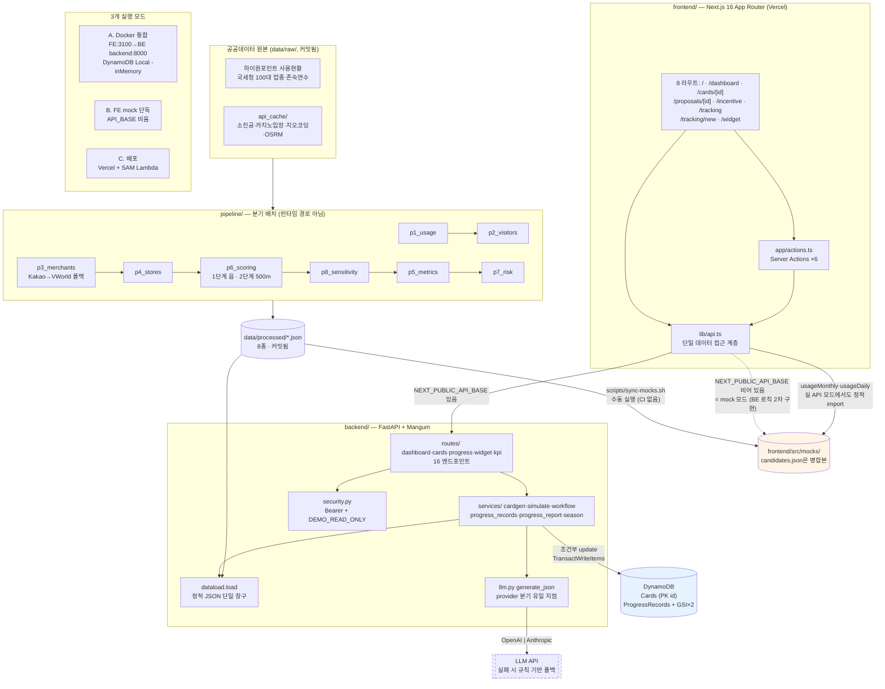

# 상생 나침반 — 코드베이스 종합 감사 보고서

감사일 **2026-08-08** · 기준 커밋 `fb32399` (main, 워킹트리 clean)
근거 원본: `docs/audit/_wip/01~06` · 절차: `docs/plan/20-codebase-audit-prompt.md`

---

## 1. Executive Summary

**전체 상태: 코드 품질이 높고 5대 데모 플로우가 코드상 모두 연결되어 있다. 심사 절대 규칙 6개는 전부 준수한다.
가장 큰 위험은 코드가 아니라 배포 설정에 있다 — 현재 `.env`와 SAM 기본값 조합으로 배포하면 데모의 쓰기 동작이 전부 403으로 막힌다.**

- **실행 가능 여부**: 백엔드 import 정상(Mangum 핸들러 생성), FE `tsc --noEmit` 0오류, `eslint` 0오류,
  금칙어 검사 통과, `docker compose config` 정상. 63개 테스트 중 **7개 실행·전부 통과**,
  56개는 DynamoDB Local이 필요해 **미실행**(§14 "새로 띄우지 말 것" 준수).
- **5대 플로우(A~E)**: **코드 경로 5개 모두 끊긴 지점 없음.** 단 B·C·D의 쓰기 구간은
  `DEMO_READ_ONLY=true`에서 403 — 이것이 **SAM 기본값**이다.
- **완성도**: 문서-코드 정합성이 이례적으로 높다. 계약(05)과 코드가 어긋난 6건은 **모두 문서 쪽이 낡은 것**이고,
  코드는 FE·BE 두 곳이 서로 일치한다. 죽은 코드는 584줄(5개 컴포넌트)로 전체 대비 작다.

### 가장 심각한 문제 3개

| 순위 | 문제 | 등급 |
|---|---|---|
| 1 | 배포 기본값(`DemoReadOnly=true` + `MUTATION_API_TOKEN` 미설정)이 데모 대본의 생성·승인·추진 단계를 전부 차단한다 | **HIGH** |
| 2 | `POST /simulate`가 계약에 없는 read-only 차단 대상인데 FE에만 가드가 없어, 읽기 전용 모드에서 버튼이 눌리고 "상태 변경" 에러가 뜬다 | **HIGH** |
| 3 | Docker 모드에서 `NEXT_PUBLIC_DEMO_READ_ONLY`가 전달될 경로가 없어 FE 잠금이 항상 해제된다 (BE만 잠기는 비대칭) | **HIGH** |

### 점수

```
Architecture                  :  9/10   계층·단일창구(dataload/llm/api.ts) 원칙이 실제로 지켜짐. 3개 실행 모드 경로 전부 성립
Frontend                      :  8/10   타입·lint 0오류, 클라이언트 번들 유출 0건, AI 폴백 정직 표기. 감점: 테스트 0, simulate 가드 누락, dead 5개
Backend                       :  9/10   조건부 업데이트·TransactWrite·멱등 지문·fail-closed 인증. 감점: health가 usage_monthly 미판정, Scan 상한 없음
AI Integration                :  9/10   LLM 단일 경로 준수, 폴백 3중 정직 표기, 타임아웃 24.5s<30s 근거 명확, 방향 오서술 양방향 가드. 감점: 모델 env가 배포에 미전달
Data Layer (DDB + 정적 JSON)  :  9/10   GSI 실사용·커서 검증·정렬키 사전순 보장·mtime 캐시 무효화. 감점: health 판정 누락
Pipeline                      :  9/10   Global Constraint(1단계↔2단계 미혼합) 준수, 산식 3중 복제 드리프트 0건. 감점: sensitivity 계약 예시 오류
Security                      :  8/10   155커밋 시크릿 이력 청정, fail-closed 토큰, limit 클램프, 로그 키 마스킹. 감점: 단일 토큰=전권(IDOR), 읽기전용 플래그 전달 경로
Infrastructure                :  6/10   SAM↔로컬 스키마 일치, 데이터 복사 단계 존재, CORS 2층 동기화. 감점: 배포 기본값이 데모를 막음, healthcheck·restart·CI 부재
Testing                       :  4/10   계산식·파이프라인 통과, LLM은 스텁(비용 0). 감점: FE 0개, 56/63 미실행, 규칙 2·5·6 회귀 검사 없음, CI 없음
심사 규칙 준수(절대 규칙 6개) : 10/10   6개 전부 준수. 1·4는 자동 검사로 회귀 방지까지 확인
Demo Ready                    :  7/10   로컬·Docker는 완결. 배포 기본값 + mock 드리프트가 감점
Production Ready              :  6/10   인증이 단일 공유 토큰, CI 없음, 배포 파라미터 수동 주입 의존
```

---

## 2. Architecture Map



---

## 3. Feature Inventory

| 기능 | 사용자 진입점 | FE 화면/컴포넌트 | api.ts | BE 엔드포인트 | Service | 저장소/외부 | 상태 |
|---|---|---|---|---|---|---|---|
| 분기 진단 대시보드 | `/dashboard` | DashboardOverview·QuarterDiagnostics·RegionStatusGrid·charts/×6 | dashboard·candidates·riskSignal·usageMonthly·usageDaily·kpi | `/api/dashboard` `/api/candidates` `/api/risk-signal` `/api/kpi` | dataload | 정적 JSON | 정상 구현 |
| 허브(의사결정 큐) | `/` | DashboardOverview·WorkQueue·DashboardDetailSections | dashboard·cards·candidates·kpi | `/api/cards` 외 | db | DynamoDB + 정적 | 정상 구현 |
| 제안 상세·승인 | `/proposals/[id]` | ProposalSummary·EvidenceSections·DecisionBar | card·dashboard·candidates | `/api/cards/{id}` `/decision` | db.decide_card | DynamoDB | 정상 구현 |
| 후보 정밀 검토 | `/cards/[id]` | MapView(MapLibre)·OriginalRankingTable·RankTrace·CandidateVerification·SimulateButton | card·dashboard·candidates·progressRecords | `/api/cards/{id}` `/verification` `/simulate` | cardgen·simulate·workflow | DynamoDB + 정적 + LLM | **부분 구현** (simulate 가드 §6-H2) |
| AI 카드 생성 | 허브 버튼 | GenerateCardButton | generate | `POST /api/cards/generate` | cardgen + llm | DynamoDB + LLM | 정상 구현 |
| 페이백 시나리오 | `/incentive` | ScenarioTable·ScenarioLadder·PaybackCycle·PaybackImpactPanel·IncentiveDecision | dashboard·cards | `/api/cards?type=INCENTIVE` | cardgen | DynamoDB | 정상 구현 |
| 상태 트래킹·경과 리포트 | `/tracking` | ProgressReportDashboard·ProgressRecordTimeline·ProgressSelect·PeriodFilter | cards·kpi·progressReport·progressRecords | `/api/progress-report` `/cards/{id}/progress-records` | progress_report·progress_records | DynamoDB(GSI×2) | 정상 구현 |
| 진행 기록 입력 | `/tracking/new` | ProgressRecordForm | cards·createProgressRecord | `POST /progress-records` | progress_records | DynamoDB(TransactWrite) | 정상 구현 |
| 방문객 위젯 | `/widget` | KakaoMapView·TodayPick·WidgetLiveRefresh·CategoryIcon | widget·dashboard·candidates·cards·usageDaily | `/api/widget/recommend` | widget | 정적 + DynamoDB | 정상 구현 |
| 헬스 체크 | — | (없음) | — | `/api/health` | dataload | 정적 | 정상 구현(FE 미사용, 의도) |

**파이프라인 산출물 8종 — 전부 소비된다.** 단 `sensitivity.json`은 파이프라인 내부(`p5_metrics.py:135`)에서만
소비되고 BE/FE 어느 쪽도 직접 읽지 않는다(§9 참조).

---

## 4. API Connectivity Matrix

| # | Method / Path | FE 호출부 | 요청 | 응답 | 05 계약 일치 | 가드 | 상태 |
|---|---|---|---|---|---|---|---|
| 1 | GET `/api/health` | 없음 | — | `{ok,demo_read_only,data_loaded,datasets}` | ○ | 없음 | 정상(FE 미사용) |
| 2 | GET `/api/dashboard` | 8개 page | — | `Dashboard` | ○ | 없음 | 정상 |
| 3 | GET `/api/candidates` | 4개 page | — | `CandidatesResponse` | ○ | 없음 | 정상 |
| 4 | GET `/api/risk-signal` | dashboard | — | `RiskSignal[]` | ○ | 없음 | 정상 |
| 5 | GET `/api/cards` | 5개 page | `?type&status` | `{cards}` | ○ | 없음 | 정상 |
| 6 | POST `/api/cards/generate` | GenerateCardButton | `{type}` | `{card}` 201/200 | ○ | mutation | 정상 |
| 7 | GET `/api/cards/{cid}` | cards/[id]·proposals/[id] | — | `{card}` | ○ | 없음 | 정상 |
| 8 | POST `/api/cards/{cid}/decision` | DecisionActions·DecisionBar | `{decision,selected_rate?}` | `{card}` | ○ | mutation | 정상 |
| 9 | POST `/api/cards/{cid}/simulate` | SimulateButton | `{}` | `{simulation}` | **△ 가드 불일치** | mutation | **부분 구현** |
| 10 | POST `/api/cards/{cid}/progress` | ProgressSelect | `{progress,idempotency_key?}` | `{card,record,created}` | △ 문서는 `{card}`만 | mutation | 정상 |
| 11 | POST `/api/cards/{cid}/verification` | CandidateVerification | `{checks[{label,status}]}` | `{card}` | **△ 문서는 `key`·`note`** | mutation | 정상 |
| 12 | POST `/api/cards/{cid}/progress-records` | ProgressRecordForm | `ProgressRecordInput` | `{card,record,created}` 201/200 | ○ | mutation | 정상 |
| 13 | GET `/api/cards/{cid}/progress-records` | cards/[id]·tracking | `?limit&cursor` | `{records,next_cursor}` | ○ | internal 🔒 | 정상 |
| 14 | GET `/api/progress-report` | tracking | `?from&to` | `ProgressReport` | ○ | internal 🔒 | 정상 |
| 15 | GET `/api/widget/recommend` | widget | `?region&category&limit` | `WidgetResponse` | ○ | 없음 | 정상 |
| 16 | GET `/api/kpi` | 3개 page | — | `Kpi` | **△ 문서에 2필드 누락** | 없음 | 정상 |

- **FE가 호출하지만 존재하지 않는 API: 0건.**
- **BE에 있으나 FE가 부르지 않는 것: `/api/health` 1건**(배포 진단용, 의도됨).
- BE 엔드포인트 없이 FE 정적 import: `usageMonthly`·`usageDaily` — 05 §6:584가 명시 계약.

---

## 5. 절대 규칙 준수 매트릭스

| # | 규칙 | 검증 방법 | 근거 파일 | 판정 |
|---|---|---|---|---|
| 1 | Gini·HHI 용어 UI 비노출 | `npm run check:banned` **실행** | `frontend/scripts/check-banned-words.mjs` → "금칙어 검사 통과" | **준수** |
| 2 | 전환율에 `근사 지표` 배지 병기 | ProxyBadge 렌더 지점 전수 추적 | 전환율 렌더 **11곳 전부** 배지 동반 (`dashboard:155,247`, `DashboardOverview:157`, `QuarterDiagnostics:43`, `cards/[id]:107`, `incentive:59`, `EvidenceSections:114`, `PaybackImpactPanel:53`, `ProgressReportDashboard:321,400`, `ProgressRecordForm:526`, `ProgressRecordTimeline:141`) | **준수** |
| 3 | 가정 기반 전망 문구 고정 삽입 | BE 삽입 + FE 배지 양측 | BE `cardgen._ensure_assumption:343`, `cards.py:17,285`, `cardgen.py:557` / FE `AssumptionBadge`·`AssumptionNote` **14곳** | **준수** |
| 4 | AI는 제안만 · "실행" 표현 금지 | 상태기계 + 금칙어 + 폴백 표기 | 생성 카드 항상 `status="pending"`(`cardgen.py:429,531`); `실행하겠습니다` 검사 통과; 폴백은 데이터·본문·칩 3중으로 "AI 아님" 표기 | **준수** |
| 5 | 원 Score 순위 항상 병기 | 저장 + 렌더 양측 | 저장 `cardgen.py:451-453`(INCENTIVE만 null — 계약대로) / 렌더 `OriginalRankingTable`·`RankTrace` 4개 화면 | **준수** |
| 6 | 국세청 = 진단 참고용 | 화면 표기 + AI 프롬프트 | `dashboard:650-676` 막대·순위 없이 수치 나열 + "비교나 순위 근거로 쓰지 않는다"; `'위험'` 문자열은 주석에만; `prompts.py:27-28`이 AI에도 금지 지시 | **준수** |

**6개 전부 준수. 위반 지점 없음.**

---

## 6. 주요 문제

> **조치 이력 — 2026-08-09, 브랜치 `fix/audit-p0`**
> P0 3건(H1·H2·H3)은 수정 완료. 아래 본문은 감사 시점(2026-08-08) 기록을 그대로 둔다.
> - **H1** `infra/deploy-backend.sh`에 배포 전 가드 추가 — `DEMO_READ_ONLY` 미설정이면 "변경 API가
>   전부 403이 된다"고 경고하고, 읽기 전용을 풀었는데 `MUTATION_API_TOKEN`이 비면 배포를 중단한다.
>   루트 `.env`에 `DEMO_READ_ONLY=false` + 난수 토큰 기입(비커밋). `docs/plan/09` §1·§5의
>   상충하던 지시를 "FE·BE 같은 값" 한 쌍으로 통일.
> - **H2** `POST /simulate`의 가드를 `require_internal_access`로 낮춰 05 §8 계약과 일치시킴
>   (Bearer는 유지 — LLM 호출 보호). 회귀 테스트 `test_public_demo_read_only_keeps_simulate_open` 추가.
> - **H3** `docker-compose.yml` frontend에 `NEXT_PUBLIC_DEMO_READ_ONLY`(+ 담당자 표시명 2종) 전달.
>
> 검증: 백엔드 65 passed(감사 때 미실행이던 스모크 포함) · pipeline 4 passed ·
> FE `tsc --noEmit`·`eslint`·`check:banned` 통과.

### [HIGH] H1. 배포 기본값이 데모 대본의 쓰기 동작을 전부 차단한다

```
위치:      infra/template.yaml:14-17 · infra/deploy-backend.sh:13,17 · .env(로컬)
관련 코드:  security.require_mutation_access · POST generate/decision/progress/verification/progress-records
문제:      SAM 파라미터 DemoReadOnly의 Default가 'true'이고, deploy-backend.sh는 DEMO_READ_ONLY 환경변수가
           "비어 있지 않을 때만" 파라미터를 넘긴다. 로컬 .env에는 DEMO_READ_ONLY 키 자체가 없다.
           같은 이유로 MUTATION_API_TOKEN도 전달되지 않아 SAM Default ''가 적용된다.
           → 배포 Lambda: 변경 API 6개 전부 403(read-only). 403을 풀어도 그다음은 503(토큰 미설정).
           09 문서는 §1(:122-123)에서 "비워 두면 true가 적용돼 공개 mutation이 열리지 않는다"를 의도로 적고,
           §2(:144)에서는 FE NEXT_PUBLIC_DEMO_READ_ONLY=false("심사위원이 직접 승인해 보게 하려면")를 지시한다 —
           두 지시를 문자 그대로 따르면 FE 버튼은 열리고 BE는 막힌다.
영향:      데모 대본(11 문서) 2-b(카드 생성)·5(승인)·6(적격성·단계 전이)이 배포 URL에서 전부 실패.
           심사위원 무안내 접속에서도 승인 버튼이 동작하지 않는다.
재현 조건:  현재 .env 그대로 `infra/deploy-backend.sh` 실행 후 배포 URL에서 승인 클릭.
수정 방향:  루트 .env에 `DEMO_READ_ONLY=false` + `MUTATION_API_TOKEN=<난수>` 추가,
           Vercel에 같은 값을 `API_MUTATION_TOKEN`으로, `NEXT_PUBLIC_DEMO_READ_ONLY=false`로 설정.
           deploy-backend.sh에 두 값 누락 시 경고를 출력하는 가드를 넣으면 재발을 막는다.
```

### [HIGH] H2. `POST /simulate`가 계약에 없는 read-only 차단 대상이고 FE 가드만 빠져 있다

```
위치:      backend/app/routes/cards.py:190 · frontend/src/app/actions.ts:132 · components/SimulateButton.tsx
관련 코드:  security.require_mutation_access · simulateAction · SimulateButton
문제:      05 §8:620의 DEMO_READ_ONLY 차단 대상은 generate/decision/verification/progress 4개다.
           simulate는 목록에 없는데 cards.py:190이 require_mutation_access를 걸어 403이 된다.
           동시에 actions.ts의 6개 액션 중 simulateAction만 isDemoReadOnly 조기 반환이 없고
           (다른 5개는 :58,:73,:88,:103,:121에 있다), SimulateButton에도 비활성화 처리가 없다.
영향:      읽기 전용 모드에서 "이 후보가 가맹 전환하면?" 버튼이 활성 상태로 보이고, 누르면
           빨간 alert에 "공개 데모는 읽기 전용입니다. 상태 변경은…"이 뜬다. simulate는 상태를
           바꾸지 않는 순수 계산인데 사용자에게는 "상태 변경 실패"로 읽힌다. 데모 4단계가 깨진다.
재현 조건:  DEMO_READ_ONLY=true(배포 기본값)인 BE + /cards/{id} 진입 → 버튼 클릭.
수정 방향:  둘 중 하나로 통일한다. (권장) simulate는 읽기 연산이므로 cards.py:190을
           require_internal_access로 낮춰 계약과 맞춘다. 또는 계약(05 §8)에 simulate를 추가하고
           simulateAction·SimulateButton에 isDemoReadOnly 가드를 넣는다.
```

### [HIGH] H3. Docker 모드에서 `NEXT_PUBLIC_DEMO_READ_ONLY`가 전달될 경로가 없다

```
위치:      docker-compose.yml:61-77 · frontend/next.config.mjs:19-22,45
관련 코드:  lib/runtime.ts:11 isDemoReadOnly
문제:      frontend 서비스에 NEXT_PUBLIC_DEMO_READ_ONLY가 설정돼 있지 않고, env_file도 없다
           (OPENAI_API_KEY 유입 차단을 위한 의도적 결정 — :75 주석).
           next.config.mjs가 루트 .env에서 이 키를 승계하도록 허용목록에 넣었지만(:45),
           fromRootEnv는 `new URL("../.env", import.meta.url)`을 읽는다. 컨테이너에는
           ./frontend만 마운트되므로(:79) 그 경로가 /.env로 풀려 존재하지 않고 catch가 {}를 반환한다.
영향:      Docker 모드에서 isDemoReadOnly는 항상 false. 루트 .env에 DEMO_READ_ONLY=true를 넣으면
           BE만 잠기고 FE 버튼은 전부 열린 채 클릭 시 403이 난다 — 읽기 전용 잠금의 비대칭 우회.
재현 조건:  루트 .env에 DEMO_READ_ONLY=true 추가 → docker compose up -d → 승인 버튼 클릭.
수정 방향:  docker-compose.yml frontend environment에
           `NEXT_PUBLIC_DEMO_READ_ONLY: "${DEMO_READ_ONLY:-false}"` 한 줄 추가.
           (NEXT_PUBLIC_OPERATOR_NAME/TEAM도 같은 이유로 전달되지 않으니 함께 처리)
```

### [MEDIUM] M1. mock 모드가 BE의 상태 전이 규칙을 구현하지 않는다

```
위치:      frontend/src/mocks/store.ts:204-209 vs backend/app/services/workflow.py:83-125
문제:      BE의 can_set_progress(순차 전이·완료 불가역·보류는 직전 단계로만 재개)가 mock에는 전혀 없다.
           mock은 progressOptions 목록에 있으면 무조건 허용한다.
영향:      mock 모드에서 "후보 접촉·검토 시작 → 완료" 건너뛰기가 성공한다. 데모 6단계의 핵심 설명
           ("단계별로만 진행되고 건너뛰기 불가")과 정반대로 동작한다. 12 문서는 mock을 배포 비상
           폴백으로 규정하므로, 비상 전환 시 심사위원에게 다른 이야기를 하게 된다.
재현 조건:  NEXT_PUBLIC_API_BASE 비운 상태로 /tracking에서 승인 카드 상태를 완료로 직접 변경.
수정 방향:  store.ts의 writeProgressRecord에서 lib/cardWorkflow.ts에 canSetProgress를 추가해 호출.
           workflow.py의 규칙을 TS로 1:1 이식하면 이후 드리프트도 한 파일에서 관리된다.
```

### [MEDIUM] M2. `OPENAI_MODEL`·`ANTHROPIC_MODEL`이 배포 Lambda에 전달되지 않는다

```
위치:      backend/app/llm.py:44-45 · infra/template.yaml:47-55 · infra/deploy-backend.sh:10-18
문제:      llm.py는 두 값을 읽어 모델을 고르지만, SAM 템플릿의 Lambda 환경변수 8개에도
           deploy 스크립트의 파라미터 7개에도 없다.
영향:      배포 환경은 .env 설정과 무관하게 항상 코드 기본값(gpt-4o-mini / claude-sonnet-5)을 쓴다.
           모델을 바꿔 배포하려면 코드 수정이 필요하다.
수정 방향:  template.yaml에 OpenAiModel·AnthropicModel 파라미터 + 환경변수 2줄,
           deploy-backend.sh에 전달 2줄 추가.
```

### [MEDIUM] M3. `/api/health`가 `usage_monthly`를 판정하지 않는다

```
위치:      backend/app/main.py:33-34 vs backend/app/routes/cards.py:201
문제:      REQUIRED_DATASETS는 dashboard·eup_scores·candidates·merchants 4종인데,
           simulate가 usage_monthly를 읽는다.
영향:      배포 후 usage_monthly.json만 누락되면 health는 ok:true인데 POST /simulate만 503이 된다.
           health의 목적(배포 후 data 복사 누락 조기 발견)에 구멍이 생긴다.
수정 방향:  main.py:33 REQUIRED_DATASETS에 "usage_monthly" 추가(05 §5의 datasets 목록도 함께 갱신).
           usage_daily는 없어도 AI 입력 ⑧만 생략되므로 OPTIONAL로 두는 것이 맞다.
```

### [MEDIUM] M4. 타입이 non-nullable인데 파이프라인이 null을 낼 수 있다

```
위치:      frontend/src/types/index.ts:42,113-117 vs pipeline/p5_metrics.py:123,130 · p6_scoring.py:251,366
문제:      Dashboard.growth({mom_pct,qoq_pp})와 Candidate.source_category가 non-nullable로 선언됐지만
           파이프라인은 조건에 따라 None을 쓴다. 현재 산출 데이터에는 null이 없어 드러나지 않는다.
영향:      데이터 기간이 짧아지거나(conv_months<6) 전월 값이 0 이하이면 FE에서 null 역참조 가능.
수정 방향:  types/index.ts에서 두 필드를 nullable로 바꾸고 렌더 지점에 `—` 폴백을 넣는다.
```

### [MEDIUM] M5. 절대 규칙 2·5·6에 회귀 방지 수단이 없다

```
위치:      frontend/scripts/check-banned-words.mjs (규칙 1·4만 커버) · .github/ 부재
문제:      배지 병기(2)·원 순위 병기(5)·국세청 표기(6)는 자동 검사가 없다. 또한
           check-banned-words.mjs:30은 frontend/src만 스캔하므로, BE가 만든 카드 문구(LLM narrative)가
           화면에 렌더되는 경로는 검사 범위 밖이다 — 프롬프트에도 용어 금지 지시가 없다.
영향:      리팩터링 시 조용히 규칙이 깨질 수 있고, 심사 직전에 발견된다.
수정 방향:  (a) prompts.py의 시스템 프롬프트에 "지니·Gini·HHI 용어 사용 금지" 한 줄 추가,
           (b) 렌더 테스트 3개(전환율 화면에 ProxyBadge / EXPANSION 카드에 OriginalRankingTable /
               risk 섹션에 순위·경고색 없음)를 추가, (c) 최소 CI 워크플로 도입(§12 P2).
```

### [MEDIUM] M6. 민감도 결과(16%)가 05 문서 예시(88%)와 크게 다르다 — 심사 대응

```
위치:      docs/plan/05-api-contract.md:576 vs data/processed/sensitivity.json
문제:      계약 문서 예시는 {"combos": 25, "top3_stable_ratio": 0.88}인데 실제 산출은
           combos=95, top3_stable_ratio=0.1579다. 95는 P8 격자(5×19)가 내는 값이라
           25는 도달 불가능한 수다. 화면(dashboard:688-701)은 16%를 "추천 순위 안정도 · 해석 주의"
           라벨과 STABILITY_NOTE 캐비엇으로 정직하게 표시한다 — 표기 자체는 문제없다.
영향:      11 문서 Q&A "가중치는 왜 그렇게 정했나 → Top3 유지율 X% 슬라이드"에 16%가 들어가면
           방어 논거가 약해진다. 05 문서의 88%를 슬라이드로 옮기면 사실과 다른 발표가 된다.
           (보강 근거: 읍 선정 자체는 95개 조합 중 57개(60%)가 영월군·삼척시를 유지한다.)
수정 방향:  05 문서 예시를 실제 값으로 교체. 발표에서는 "Top3 순위 유지 16%, 그러나 지역 선정은
           60% 유지"로 층위를 나눠 말하고, 순위가 아니라 지역 선택의 강건성을 논거로 쓴다.
```

### [MEDIUM] M7. Docker 기동 순서에 healthcheck가 없다

```
위치:      docker-compose.yml:34,55 (depends_on만, condition 없음) · :12-15 (dynamodb에 healthcheck 없음)
문제:      seed는 30회×2초 재시도 루프(:37-38)로 공백을 메우지만 backend에는 재시도가 없다.
           boto3 Table()이 지연 객체라 기동 자체는 성공하고, 실패는 첫 DynamoDB 접근에서 난다.
           dynamodb는 -inMemory -sharedDb라 컨테이너 재시작 시 테이블이 사라지고,
           restart 정책이 없어(seed만 "no" 명시) 죽으면 조용히 내려간 채 남는다.
영향:      seed 완료 전에 /api/cards를 호출하면 ResourceNotFoundException → 500.
수정 방향:  dynamodb에 healthcheck를 붙이고 seed·backend를 condition: service_healthy로 바꾼다.
```

### [LOW] L1~L8 (요약)

| # | 문제 | 위치 |
|---|---|---|
| L1 | 05 계약 문서 6건이 코드와 불일치 — **전부 문서 쪽 오류**(§8 표) | `docs/plan/05-api-contract.md` |
| L2 | 죽은 컴포넌트 5개 584줄 + 실행되지 않는 `local_init.py` 21줄 | §9 |
| L3 | 미사용 mock JSON 3개 약 375KB (`eup_scores`·`merchants`·`sensitivity`) | `frontend/src/mocks/` |
| L4 | `backend/.dockerignore` 없어 빌드 컨텍스트 111MB(`.venv` 110MB) 전송 | `backend/` |
| L5 | `mock_rule` 칩 매핑이 계약(05:287)과 FE(`aiSource.ts:46`)에서 다름 | 둘 다 "AI 아님"이라 정직성 영향 없음 |
| L6 | 커밋된 PNG/PDF 약 7MB + `.superpowers/sdd/` 마크다운 13개 추적 | 레포 루트 |
| L7 | `/proposals/[id]`·`/tracking/new`에 `loading.tsx` 없음, 세그먼트별 `error.tsx` 없음 | `frontend/src/app/` |
| L8 | 문서·CLAUDE.md의 예시 명령이 `python`인데 이 환경엔 없음(`python3`/venv 필요) | `CLAUDE.md:22,25` 등 |

---

## 7. Broken Flow

**코드 경로가 끊긴 플로우는 없다.** 아래는 *설정*으로 막히는 지점이다.

```
[B] AI 카드 생성
GenerateCardButton ─→ generateAction ─→ api.generate ─→ POST /cards/generate
                                                          │
                                          ┌───────────────┴───────────────┐
                                          ↓                               ↓
                              DEMO_READ_ONLY=false                DEMO_READ_ONLY=true
                              (로컬 Docker 기본)                   ★ SAM 배포 기본값 ★
                                          ↓                               ↓
                              cardgen → LLM/폴백 → 201            ✗ 403 차단 (H1)

[C] 승인 · [D] 추진 기록  — 동일 분기, 동일 차단

[4단계] 시뮬레이션
SimulateButton(항상 활성) ─→ simulateAction(가드 없음) ─→ POST /simulate
                                                            ↓
                                                DEMO_READ_ONLY=true → ✗ 403
                                                "상태 변경은…" 문구 노출 (H2)
                                                ↑ 계약(05 §8)에는 차단 대상 아님

[mock 모드 전용] 단계 전이
ProgressSelect ─→ store.setProgress ─→ ✗ can_set_progress 미구현 (M1)
                                        → 완료로 건너뛰기 성공 (실 API는 409)
```

---

## 8. Mock / Dummy / Incomplete

### `frontend/src/mocks/store.ts` ↔ BE 로직 드리프트 (주요 항목)

| 영역 | mock | BE | 영향 |
|---|---|---|---|
| **순차 전이 규칙** | 없음 (store.ts:207-209) | `workflow.can_set_progress:83-125` | **M1 — 건너뛰기 허용** |
| **generate 재클릭** | 무조건 409 (store.ts:397) | pending 있으면 200+기존 카드 (cardgen.py:400-411) | 2-b 두 번 클릭 시 모드별 상이 |
| **카드 목록 정렬** | 정렬 없음 (store.ts:73) | `created_at` desc (cards.py:70) | 허브 카드 순서 상이 |
| `decision` 값 검증 | 없음 | 400 (cards.py:112) | mock이 계약 밖 값 저장 |
| `selected_rate` 범위 | truthy만 (store.ts:97) | `in (3,5,7)` 400 (cards.py:117) | rate=4가 mock에서 저장됨 |
| 적격성 라벨/상태/중복 | 전부 미검증 | 각각 400 (cards.py:344-349) | 계약 밖 status 저장 가능 |
| `recorded_at` 3종 검증 | 없음 | 미래5분·생성이전·최신이전 400 | — |
| 완료 시 `progress_pct=100` | 없음 | 400 (progress_records.py:154) | — |
| 멱등 지문 | 키만 대조, 본문 해시 없음 | `_request_fingerprint` → 409 | 같은 키·다른 본문이 조용히 옛 기록 반환 |
| Pydantic 검증 상태코드 | 400 | **422** | 다수 항목 |
| `decide`의 version 증가 | 안 함 (store.ts:91-112) | `ADD #version 1` (db.py:138) | mock 카드 version 드리프트 |
| INCENTIVE 생성 출처 | `rule_seed`(시드 복사) | `mock_rule`이어야 함(05:287) | 칩은 동일, 계약만 불일치 |
| 위젯 정렬 tie-break | 2키 | 4키(+name,address) | 동거리 순서 상이 |
| 위젯 payback 최신 판정 | `decided_at`만 | `completed_at`→이벤트→`decided_at` | 완료 INCENTIVE 2장 이상일 때 rate 상이 |
| `source` 기본값 | `"manual"` | `"quick_status"`/`"담당자 입력"` | 기록 출처 표시 상이 |

**mock 모드 상태 지속성**: `store.ts:57,66,69,70`이 모듈 스코프 가변 상태다.
`lib/api.ts`는 서버 컴포넌트에서만 import되므로 이 상태는 **Next 서버 프로세스**에 산다 —
새로고침해도 유지되어 데모 루프가 성립한다. 단 서버 재시작·HMR 재평가 시 초기화되고,
**워커가 여러 개인 배포에서는 인스턴스마다 상태가 갈린다**(Vercel 서버리스에서 비상 폴백으로 쓸 때의 한계).

### 의도적 목업으로 남은 것
- `MockOutcomeReport.tsx`: 카드 id 문자합 seed로 "정책 성과 리포트" 수치를 합성한다(`:21,31,33`).
  **어디에서도 import되지 않는다** → 화면에 도달하지 않음. §9에서 삭제 대상으로 분류.
- `usageMonthly`/`usageDaily`의 정적 반환은 목업이 아니라 **계약된 설계**(05 §6:584).
  현재 `data/processed` ↔ `mocks` 7/8 파일이 바이트 동일이라 드리프트 없음.

---

## 9. Dead Code

| 대상 | 줄 수 | 근거 | 분류 |
|---|---|---|---|
| `components/MockOutcomeReport.tsx` | 137 | import 0건 (docs만 언급) | **삭제 가능** |
| `components/RegionScoreTable.tsx` | 155 | import 0건 | **삭제 가능** |
| `components/CountUp.tsx` | 69 | import 0건 (17 문서 계획에만 존재) | **삭제 가능** |
| `components/RegionDiagnosticMap.tsx` | 20 | import 0건 | **삭제 가능** |
| `components/RegionTileMap.tsx` | 210 | 유일 importer가 위 dead 파일 → dead 클러스터 | **삭제 가능** |
| `backend/local_init.py` | 21 | 실행 주체 없음. `seed_demo.py --init`이 대체(`seed_demo.py:4,459`) | **삭제 가능** |
| `mocks/eup_scores.json`·`merchants.json`·`sensitivity.json` | 375KB | import 0건 (FE는 병합된 candidates.json으로 도달) | **삭제 가능**(sync-mocks.sh 복사 목록에서도 제외) |
| `simulate.expected_monthly_count()` | — | 테스트만 호출. 프로덕션 `simulate_expansion`은 같은 계산을 인라인(`:175-178`) | 의도적 보류(테스트 계약) |
| `workflow.is_verified` | — | 모듈 내부에서만 호출(`workflow.py:123`) | 의도적 보류 |
| `cardgen._find_pending`(EXPANSION 경로) | — | `_available`이 먼저 걸러 도달 불가 — `cardgen.py:405-406`이 명시 | 의도적 보류(문서화됨) |

**TODO/FIXME/HACK/XXX/NotImplemented: 1차 코드에 0건.** 미구현 스텁도 0건
(`return None` 18곳 전부 문서화된 빈 케이스 가드).

---

## 10. Security Findings

### 시크릿 커밋 이력 — **오염 없음** (Public 전환 가능)
- 전 브랜치 **155개 커밋** 픽액스 검사(`sk-`, `sk-ant`, `AKIA`, 각 `*_API_KEY=`, `serviceKey`) →
  **모든 히트가 변수명·마스킹 정규식·빈 대입·부분문자열 오탐**(`risk-signal`, `queue-microtask`)·
  PNG 바이너리 바이트·이 감사 프롬프트 문서였다. **실키 값 0건.**
- `.env`는 한 번도 커밋된 적 없다(`git log --all --diff-filter=A -- '*.env'` → 0). `.gitignore:2`가 잡는다.
- `git grep -nIE '(API_KEY|SECRET|TOKEN|serviceKey|apikey)[":= ]{1,4}[A-Za-z0-9/+_-]{20,}'` → 출력 없음.
- `.env.example` 21키 중 값 있는 6개는 전부 비밀이 아님(provider·모델 ID·리전·불리언).
- `data/raw/api_cache/` 커밋분 10개 중 키 포함 0건. `geocode.json`은 ignore + 커밋 이력 0건.
- 빌드 산출물 추적 0건.

### 인증·권한
- **변경 API 6개 전부 가드 있음. 무방비 변경 엔드포인트 0건.**
- `MUTATION_API_TOKEN` 미설정 시 **503으로 닫힌다**(`security.py:19-23`) — **fail-open 아님.**
- 토큰 비교는 `secrets.compare_digest`(`:33`).
- compose 기본값 `local-dev-token`이 배포로 새는 경로 없음(deploy 스크립트가 빈 값을 넘기지 않음).
- **IDOR**: `card_id`만 알면 상태 변경 가능하다. 방어는 단일 Bearer 토큰뿐이며
  토큰 보유자는 전권이다. `security.py:40` 주석이 이 한계를 명시(사용자/역할 체계 미도입).
  로그인 없는 데모 서비스의 수용된 제약으로 판단한다.
- `API_MUTATION_TOKEN`은 `NEXT_PUBLIC_` 접두사가 없고 `lib/api.ts`는 서버 컴포넌트에서만 쓰인다 —
  클라이언트 컴포넌트의 데이터 계층 import **0건**(전수 검사) → 브라우저 번들 유출 없음.

### 입력 검증
- 위젯 `?limit=99999` → `max(1, min(120, limit))`로 **120 클램프**. 전량 덤프 불가.
- progress-report 기간: 역순·미래·366일 이상 전부 400 → 스캔 폭발 방지.
- 커서: base64 디코딩 실패·필수 키 누락·타 카드 커서 전부 거부.

### 로그
`llm.redact`(`llm.py:14-19`)가 키 패턴을 마스킹하고 `raise ... from None`(`:93`)으로 원인 체인을 끊는다.
**프롬프트 본문은 로그에 남지 않는다**(provider·model·elapsed만 기록).

### 남은 위생 항목 (Public 전환 전 확인)
- 커밋된 PDF 2개(대회 배포 문서 546KB) — 개인정보 포함 여부 육안 확인 권장.
  `.gitignore`가 제외한 `기획서_V.I.B.E.pdf`·`MVP_상생나침반_개정판.pdf`는 커밋 이력 0건으로 안전.
- 커밋된 PNG 약 6.9MB(`image-1/2.png`, `og.png`, 브랜드 이미지) — 레포 용량 이슈.
- `.superpowers/sdd/` 에이전트 작업 보고 13개가 추적된다 — 공개 의도 여부 확인 필요.

---

## 11. Test Coverage Gap

### 축 1 — 엔드포인트
| 테스트 | 개수 | 실행 결과 |
|---|---|---|
| `backend/tests/test_smoke.py` | 50 | **미실행** (DYNAMO_ENDPOINT 필요) |
| `backend/tests/test_progress_report.py` | 6 | **미실행** (동일) |
| `backend/tests/test_algorithms.py` | 3 | ✅ 3 passed |
| `pipeline/tests/test_algorithms.py` | 4 | ✅ 4 passed |

- 56/63이 DynamoDB Local 의존. 수집 단계에서 **재현 명령을 포함한 fail-fast**로 중단되는 설계는 좋다.
- LLM은 `FakeLLM`/`_FakeOpenAI` 스텁으로 대체 — **실제 유료 호출 없음.** 키 마스킹 회귀 테스트도 있다(`:1020-1044`).
- `pipeline/tests/`는 **어떤 pytest 설정에도 잡히지 않는다**(`backend/pytest.ini`가 유일, `testpaths=tests`).
  `pipeline/requirements.txt`에 pytest 없음.

### 축 2 — 플로우
**FE 테스트 0개.** 8개 라우트·6개 Server Action·68개 컴포넌트 전부 무테스트.
E2E 자동화 없음(플레이라이트 등 부재).

### 축 3 — 절대 규칙 회귀
| 규칙 | 자동 검사 |
|---|---|
| 1 (용어) | ✅ `check-banned-words.mjs` |
| 4 ("실행하겠습니다") | ✅ 같은 스크립트 |
| 2 (근사 지표 배지) | ❌ |
| 3 (가정 기반 전망) | △ BE 계약 문구만 (FE 렌더 검사 없음) |
| 5 (원 순위 병기) | ❌ |
| 6 (국세청 참고용) | ❌ |

추가 갭: `check-banned-words.mjs`는 `frontend/src`만 스캔하므로 **LLM이 생성해 화면에 렌더되는 문구**는
검사 대상이 아니고, `prompts.py`에도 용어 금지 지시가 없다.

**CI 부재** — `.github/` 없음. lint·타입체크·테스트·금칙어 전부 수동 실행.

---

## 12. 수정 우선순위

### P0 (즉시 — 배포/심사 직결) — **2026-08-09 코드 수정 완료 (`fix/audit-p0`)**
1. ✅ **H1** 루트 `.env`에 `DEMO_READ_ONLY=false`·`MUTATION_API_TOKEN=<난수>` 추가.
   `deploy-backend.sh`에 누락 가드 추가(경고 + 불일치 시 배포 중단), 09 문서 지시 통일.
   **남은 수동 작업:** Vercel 대시보드에 `API_MUTATION_TOKEN`(`.env`와 동일 값)·
   `NEXT_PUBLIC_DEMO_READ_ONLY=false`·`NEXT_PUBLIC_API_BASE` 등록 — 코드로 처리할 수 없다.
2. ✅ **H2** `POST /simulate`의 가드를 `require_internal_access`로 낮춰 05 §8 계약과 일치시켰다.
3. ✅ **H3** `docker-compose.yml` frontend에 `NEXT_PUBLIC_DEMO_READ_ONLY: "${DEMO_READ_ONLY:-false}"` 추가.

### P1 (제출·데모 전)
4. **M1** mock의 `setProgress`에 순차 전이 규칙 이식 (`lib/cardWorkflow.ts`에 `canSetProgress`).
5. **M6** 05 문서의 `sensitivity.json` 예시를 실제 값(95 / 0.1579)으로 교체하고,
   발표 논거를 "Top3 16% / 지역 선정 60%"로 층위를 나눠 준비.
6. **M3** `REQUIRED_DATASETS`에 `usage_monthly` 추가.
7. **L1** 05 계약 문서 6건 수정 (operations 필드명, checks key, verification body,
   KPI 2필드, simulate 2필드, sensitivity 예시).
8. mock의 카드 목록 정렬을 `created_at` desc로 맞춰 허브 화면 순서를 두 모드에서 통일.

### P2 (안정화)
9. **M5** `prompts.py`에 용어 금지 지시 + 규칙 2·5·6 렌더 테스트 3개 추가.
10. **CI 최소 워크플로** 도입:
    ```yaml
    # .github/workflows/ci.yml (제안)
    on: [push, pull_request]
    jobs:
      fe: npx tsc --noEmit · npm run lint · npm run check:banned · npm run build
      be: docker compose up -d dynamodb → DYNAMO_ENDPOINT=... pytest -q
      pipe: pytest pipeline/tests -q
    ```
11. **M2** SAM에 `OPENAI_MODEL`·`ANTHROPIC_MODEL` 파라미터 추가.
12. **M4** `Dashboard.growth`·`Candidate.source_category`를 nullable로 정정 + 렌더 폴백.
13. **M7** dynamodb healthcheck + `condition: service_healthy`.
14. mock의 검증 누락분(decision 값·rate 범위·적격성 3종) 보완.

### P3 (개선)
15. dead code 5개 컴포넌트 584줄 + `local_init.py` 삭제.
16. 미사용 mock JSON 3개(375KB) 삭제 + `sync-mocks.sh` 복사 목록 정리.
17. `backend/.dockerignore` 추가(`.venv`·`tests`·`__pycache__`).
18. `/proposals/[id]`·`/tracking/new`에 `loading.tsx` 추가.
19. 레포 루트 PNG(약 6.9MB) 정리, `.superpowers/` 추적 여부 결정.
20. `CLAUDE.md`·문서의 `python` 예시를 `python3`/venv 경로로 정정.

---

## 13. 최종 판정 (§17)

| # | 질문 | 판정 | 근거 |
|---|---|---|---|
| 1 | Docker 통합 모드로 전체 스택이 정상 기동하는가? | **NOT VERIFIED** | `docker compose config -q` 통과(문법·보간 정상), 포트 정합 확인. 그러나 스택 미기동(§14 "새로 띄우지 말 것") — 실제 기동은 검증하지 못함 |
| 2 | FE mock 단독 모드가 BE 없이 성립하는가? | **YES** | `api.ts:67,91`이 `BASE` 없으면 mock 반환. `store.ts`가 14개 파생 함수 구현. 단 M1 등 로직 드리프트 존재 |
| 3 | FE↔BE 연결이 16개 엔드포인트 전부에서 완전한가? | **PARTIAL** | 15개 정상. `/api/simulate`만 가드 불일치(H2). `/api/health`는 FE 미사용(의도) |
| 4 | BE↔LLM 연결이 완전하고 키 없이 안전 폴백하는가? | **YES** | 단일 경로 준수, 키 없으면 `_fallback_ai`로 폴백하고 데이터·본문·칩 3중으로 "AI 아님" 표기 |
| 5 | BE↔DynamoDB 연결이 로컬·배포 양쪽에서 완전한가? | **YES** | SAM↔`seed_demo`/`progress_db` 테이블 정의가 필드·인덱스 단위 일치. GSI 실사용, TransactWrite 원자성 |
| 6 | 파이프라인 산출물 8종이 모두 소비되는가? | **YES** | 8종 전부 소비. 단 `sensitivity.json`은 파이프라인 내부(`p5_metrics.py:135`)에서만 |
| 7 | `data/processed` ↔ `frontend/src/mocks`는 동기화되어 있는가? | **YES** | 7/8 바이트 동일, `candidates.json`은 설계상 병합본. 단 `sync-mocks.sh`는 수동 실행뿐(CI 없음) |
| 8 | 5대 데모 플로우가 전부 끝까지 도는가? | **PARTIAL** | 코드 경로는 5개 모두 연결. B·C·D의 쓰기는 배포 기본값에서 403(H1), 4단계 simulate는 H2 |
| 9 | Mock/Dummy 응답이 실 API 모드에 남아 있는가? | **NO (의도된 1건 제외)** | `usageMonthly`/`usageDaily`의 정적 반환은 05 §6이 명시한 계약. `MockOutcomeReport`는 dead |
| 10 | 버튼은 있는데 동작하지 않는 기능이 있는가? | **YES** | 읽기 전용 모드의 "이 후보가 가맹 전환하면?" 버튼(H2). 그 외 없음 |
| 11 | 존재하지만 호출되지 않는 API/컴포넌트가 있는가? | **YES** | 컴포넌트 5개(584줄), `local_init.py`, 미사용 mock JSON 3개. API는 `/api/health` 1개(의도) |
| 12 | FE가 호출하지만 존재하지 않는 API가 있는가? | **NO** | 17개 api 함수 전부 대응 BE 또는 계약된 정적 소스 보유 |
| 13 | 변경 API가 인증 없이 열려 있는가? DEMO_READ_ONLY 우회가 가능한가? | **인증: NO / 우회: YES** | 변경 6개 전부 가드 + fail-closed. 단 Docker에서 FE 잠금이 항상 해제(H3) |
| 14 | 시크릿이 커밋 이력에 남아 있는가? | **NO** | 155커밋 픽액스 전수 검사 — 실키 0건. Public 전환 가능 |
| 15 | 절대 규칙 6개를 전부 준수하는가? | **YES** | 6/6 준수. 1·4는 자동 검사 통과, 2·3·5·6은 렌더 지점 전수 추적 |
| 16 | 현재 상태로 심사 데모가 가능한가? | **PARTIAL** | 로컬 Docker에서는 가능(§13-A~E 코드 경로 완결). 배포 URL은 P0-1·2 수정 전에는 쓰기 동작 불가 |
| 17 | 현재 상태로 배포 가능한가? | **PARTIAL** | 배포 자체는 성립(SAM 정합·데이터 복사 단계 존재). 단 `.env`에 `DEMO_READ_ONLY`·`MUTATION_API_TOKEN`을 넣지 않으면 변경 API 전체가 403/503 |

---

## 부록 — 이 감사에서 사실이 아님을 확인한 사전 의혹

프롬프트가 CRITICAL/HIGH 후보로 지목했으나 **근거로 반박된** 항목:

| 의혹 | 실제 |
|---|---|
| FE 포트 불일치(`dev` 3100 vs `dev:docker` 3000)로 Docker 접속 불가 | Dockerfile이 `dev:docker`(3000)를 실행하고 compose가 `3100:3000` 매핑 — **정합** |
| `"use client"` 컴포넌트가 `lib/api.ts`/mocks를 import해 번들 폭증 | 매치 3건 전부 **주석 안 문자열**. 실제 유출 0건 |
| `/cards/[id]`와 `/proposals/[id]` 중 하나가 Dead Route | 둘 다 진입 링크 보유(대시보드→proposals, 트래킹→cards). **역할 분리** |
| `sam build`가 `tests/`·`.pytest_cache`까지 번들에 실음 | 실측 `infra/.aws-sam/build/ApiFunction/`에 `.venv`·`tests`·`seed_demo.py` **전부 없음** |
| `progress_db.ensure_table`/`clear_table`이 Lambda에서 권한 부족 | 호출부가 `seed_demo.py`·`local_init.py`뿐이고 **Lambda 번들에 미포함** — 도달 불가 |
| AI 폴백이 "AI 생성"으로 표시될 위험 | 데이터·카드 본문·화면 칩 **3중으로 구분**. `aiSource.fold`는 미지 값이면 칩을 아예 안 그림 |
| 1단계(읍)·2단계(500m) 데이터가 한 수식에 섞임 | `stage2_candidates`가 받는 것은 **읍 이름 문자열 리스트뿐**. 혼합 표현식 0건 |
| BE `concentration_index`가 파이프라인 산식과 다를 수 있음 | 난수 6-벡터 20,000회 대조 — **불일치 0건** |
| `HIGHONE_TO_DISPLAY` 3중 복제 드리프트 | 18키 키·값·순서 **완전 일치**(유니코드 특수문자·원본 오타까지) |
| 시크릿 커밋 이력 오염 | 155커밋 전수 — **0건** |
